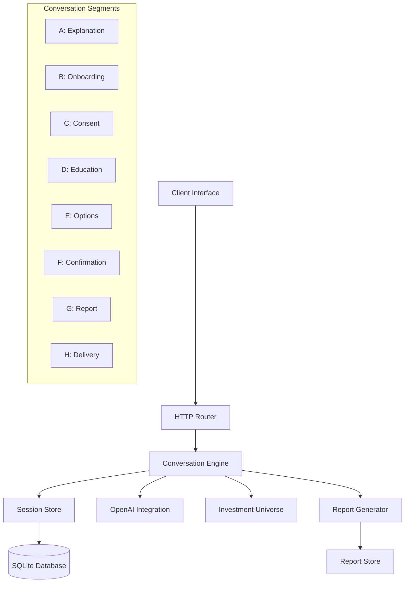

# Design Document

## Overview

The ESG Client Interview Bot is a Node.js-based conversational AI system that guides UK financial planning clients through compliant ESG investment interviews. The system implements an 8-segment conversation flow aligned with FCA Consumer Duty, COBS 9A suitability requirements, and SDR (Sustainability Disclosure Requirements). The architecture combines structured conversation management with OpenAI integration for natural language processing and generates compliant PDF suitability reports.

## Architecture

### High-Level Architecture



### System Components

1. **HTTP Server Layer**: Express.js server handling client requests and serving static assets
2. **Conversation Engine**: Core state machine managing the 8-segment interview flow
3. **Session Management**: Persistent session storage with SQLite database
4. **OpenAI Integration**: Natural language processing for free-form queries and compliance responses
5. **Investment Explorer**: Matching engine for client preferences against authorized investment universe
6. **Report Generation**: PDF creation with templating and secure artifact storage
7. **Validation Layer**: COBS 9A compliance validation and guardrail enforcement

## Components and Interfaces

### Conversation Engine (`conversationEngine.js`)

**Primary Responsibilities:**
- Manages 8-segment conversation flow state machine
- Handles both structured and free-form client inputs
- Enforces regulatory compliance and validation rules
- Integrates with OpenAI for natural language processing
- Triggers investment exploration and educational detours

**Key Functions:**
- `handleClientTurn(session, text)`: Processes client messages and advances conversation state
- `handleEvent(session, event)`: Routes different event types (messages, data updates)
- `handleFreeFormQuery(session, text)`: Delegates complex queries to OpenAI compliance assistant
- `handleDetours(session, text)`: Manages educational requests and investment exploration

**State Management:**
- Session stage tracking through `CONVERSATION_STAGES` enum
- Context preservation for resuming interrupted conversations
- Progress snapshots for detecting conversation advancement

### Session Store (`sessionStore.js`)

**Data Model:**
```javascript
{
  id: "uuid",
  stage: "SEGMENT_X_NAME",
  createdAt: "ISO timestamp",
  updatedAt: "ISO timestamp",
  data: {
    client_profile: { /* suitability data */ },
    sustainability_preferences: { /* ESG preferences */ },
    consent: { /* regulatory consents */ },
    advice_outcome: { /* advisor recommendations */ },
    audit: { /* compliance trail */ }
  },
  events: [ /* conversation history */ ],
  context: { /* conversation state */ }
}
```

**Key Operations:**
- `createSession()`: Initialize new client session with empty data structure
- `saveSession(session)`: Persist session state to SQLite database
- `applyDataPatch(session, patch)`: Deep merge updates to session data
- `appendEvent(session, event)`: Add conversation events with audit logging

### OpenAI Integration (`openAiClient.js`)

**Compliance Assistant:**
- Structured JSON responses using OpenAI function calling
- Fallback stub mode for development and testing
- Error handling with graceful degradation
- Compliance logging for educational requests and extra questions

**Response Schema:**
```javascript
{
  reply: "Natural language response",
  compliance: {
    educational_requests: ["logged topics"],
    extra_questions: ["compliance queries"],
    notes: ["advisor review items"]
  }
}
```

### Investment Explorer

**Matching Algorithm:**
- Scores investments against client profile (objectives, risk, horizon)
- Filters by sustainability preferences (labels, themes, exclusions)
- Ranks results by relevance score
- Provides both authorized and alternative investment suggestions

**Investment Data Structure:**
```javascript
{
  id: "investment_id",
  name: "Investment Name",
  type: "Fund/Portfolio",
  provider: "Provider Name",
  objectives: ["growth", "income"],
  risk_band: [min_risk, max_risk],
  labels: ["Focus", "Improvers"],
  themes: ["climate", "social"],
  charges: "fee_structure"
}
```

### Report Generator (`reportGenerator.js`)

**Template Processing:**
- Markdown template with Mustache-style variable substitution
- Context building from session data
- PDF generation with embedded fonts and formatting
- SHA-256 hash generation for audit integrity

**Artifact Structure:**
```javascript
{
  preview: "Rendered markdown text",
  pdfBuffer: Buffer,
  hash: "sha256_hash"
}
```

## Data Models

### Client Profile
```javascript
{
  client_type: "individual|joint|trust|company",
  objectives: "growth|income|preservation|impact|other",
  horizon_years: Number,
  risk_tolerance: 1-7,
  capacity_for_loss: "low|medium|high",
  liquidity_needs: String,
  knowledge_experience: {
    summary: String,
    instruments: Array,
    frequency: String,
    duration: String
  },
  financial_situation: {
    provided: Boolean,
    income: Number,
    assets: Number,
    liabilities: Number,
    notes: String
  }
}
```

### Sustainability Preferences
```javascript
{
  preference_level: "none|high_level|detailed",
  labels_interest: ["Focus", "Improvers", "Impact", "Mixed Goals"],
  themes: ["climate", "biodiversity", "social equity"],
  exclusions: [{
    sector: String,
    threshold: Number
  }],
  impact_goals: Array,
  engagement_importance: String,
  reporting_frequency_pref: "none|quarterly|semiannual|annual",
  tradeoff_tolerance: String,
  educ_pack_sent: Boolean
}
```

### Consent Records
```javascript
{
  data_processing: {
    granted: Boolean,
    timestamp: String
  },
  e_delivery: {
    granted: Boolean,
    timestamp: String
  },
  future_contact: {
    granted: Boolean,
    purpose: String
  }
}
```

## Error Handling

### Validation Layer
- **Session Validation**: Comprehensive COBS 9A compliance checking before report generation
- **Input Validation**: Type checking and range validation for all client inputs
- **Guardrail Triggers**: Automatic flagging of risk-capacity mismatches and regulatory concerns

### Error Recovery
- **OpenAI Fallbacks**: Stub responses when AI service is unavailable
- **Session Recovery**: Ability to resume interrupted conversations
- **Graceful Degradation**: Core functionality maintained even with service failures

### Compliance Safeguards
- **Mandatory Field Enforcement**: Prevents progression without required suitability data
- **Risk Override Confirmation**: Explicit client confirmation for high-risk/low-capacity combinations
- **Educational Requirements**: Ensures SDR education completion before preference capture

## Testing Strategy

### Unit Testing
- **Conversation Flow**: Test each segment's input validation and state transitions
- **Data Validation**: Verify COBS 9A compliance checking logic
- **Report Generation**: Validate PDF creation and template rendering
- **Investment Matching**: Test scoring algorithm and filtering logic

### Integration Testing
- **OpenAI Integration**: Mock API responses and test fallback mechanisms
- **Database Operations**: Session persistence and retrieval testing
- **End-to-End Flows**: Complete conversation journeys through all segments

### Compliance Testing
- **Regulatory Scenarios**: Test guardrail triggers and validation rules
- **Audit Trail Verification**: Ensure complete logging of compliance events
- **Report Accuracy**: Validate generated reports against captured data

### Performance Testing
- **Session Concurrency**: Multiple simultaneous client conversations
- **Database Performance**: SQLite operations under load
- **Memory Management**: Long-running conversation sessions

## Security Considerations

### Data Protection
- **Session Isolation**: Each client session maintains separate data context
- **Audit Logging**: Comprehensive tracking of all client interactions
- **Secure Storage**: SQLite database with appropriate file permissions

### API Security
- **Input Sanitization**: Validation of all client inputs
- **Error Information**: Careful error message handling to prevent information disclosure
- **Rate Limiting**: Protection against abuse of OpenAI integration

### Compliance Security
- **Report Integrity**: SHA-256 hashing of generated PDF reports
- **Consent Tracking**: Timestamped consent records for regulatory compliance
- **Data Retention**: Appropriate handling of sensitive financial information

## Deployment Architecture

### Development Environment
- **Local SQLite**: File-based database for development and testing
- **OpenAI Stub Mode**: Configurable mock responses for offline development
- **Hot Reload**: Development server with automatic restart on code changes

### Production Considerations
- **Database Scaling**: Migration path from SQLite to PostgreSQL for production
- **OpenAI Resilience**: Error handling and fallback strategies
- **Report Storage**: Secure file storage for generated PDF artifacts
- **Monitoring**: Logging and alerting for conversation flow issues

## Integration Points

### External Services
- **OpenAI API**: GPT-4 integration for natural language processing
- **Investment Data**: Authorized investment universe and market alternatives
- **Regulatory Updates**: Framework for incorporating FCA rule changes

### Internal Systems
- **Advisor Dashboard**: Session management and oversight capabilities
- **CRM Integration**: Client data synchronization possibilities
- **Compliance Reporting**: Audit trail export and analysis tools

This design provides a robust, compliant, and scalable foundation for the ESG Client Interview Bot while maintaining the sophisticated features already implemented in your test version.