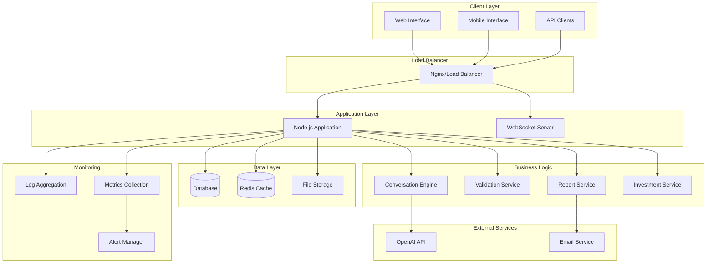
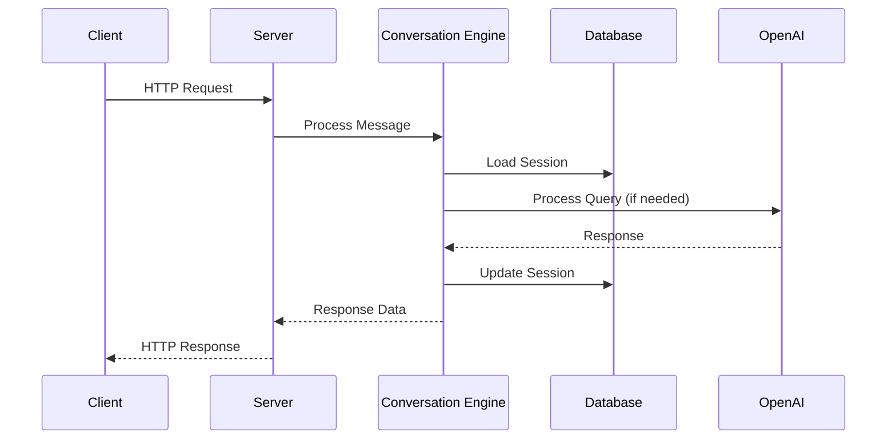
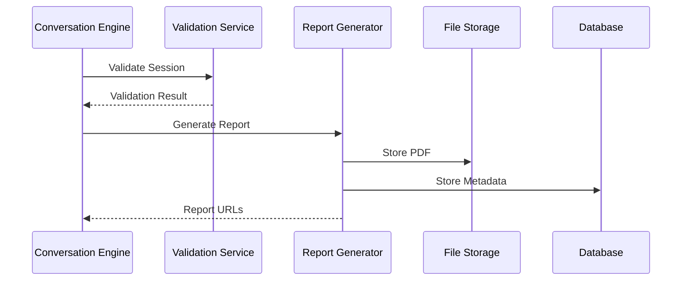

# System Architecture

## Overview

The ESG Client Interview Bot is a Node.js-based conversational AI system designed to guide UK financial planning clients through compliant ESG investment interviews. The system follows a microservices-inspired architecture with clear separation of concerns.

## High-Level Architecture



## Component Architecture

### 1. HTTP Server Layer

**Location**: `server/server.js`, `server/router.js`

**Responsibilities**:
- HTTP request handling and routing
- Static file serving
- WebSocket connection management
- Security middleware application
- Error handling and logging

**Key Features**:
- Express.js-like routing without dependencies
- Built-in security headers and CORS
- Request/response logging
- Health check endpoints

### 2. Conversation Engine

**Location**: `server/state/conversationEngine.js`

**Responsibilities**:
- Manages 8-segment conversation flow
- State machine implementation
- Input validation and processing
- Integration with OpenAI for natural language processing
- Conversation context management

**Flow Segments**:
1. **Explanation**: System introduction and purpose
2. **Onboarding**: Client identification and basic information
3. **Consent**: Data processing and regulatory consents
4. **Education**: ESG concepts and SDR label education
5. **Options**: Investment preference capture
6. **Confirmation**: Review and confirmation of captured data
7. **Report**: Suitability report generation
8. **Delivery**: Report delivery and completion

### 3. Session Management

**Location**: `server/state/sessionStore.js`

**Responsibilities**:
- Session lifecycle management
- Data persistence and retrieval
- Session state validation
- Audit trail maintenance

**Data Structure**:
```javascript
{
  id: "uuid",
  stage: "current_segment",
  data: {
    client_profile: {},
    sustainability_preferences: {},
    consent: {},
    advice_outcome: {}
  },
  events: [],
  context: {},
  audit: {}
}
```

### 4. Validation System

**Location**: `server/state/validateSession.js`

**Responsibilities**:
- COBS 9A compliance validation
- Data integrity checks
- Regulatory requirement enforcement
- Guardrail trigger detection

**Validation Rules**:
- Mandatory field completion
- Risk tolerance vs capacity for loss alignment
- Investment horizon appropriateness
- Knowledge and experience adequacy

### 5. Report Generation

**Location**: `server/report/reportGenerator.js`

**Responsibilities**:
- PDF report creation from templates
- Data formatting and presentation
- Digital signature preparation
- Report versioning and storage

**Features**:
- Markdown template processing
- Professional PDF styling
- SHA-256 hash generation for integrity
- Multi-page support with headers/footers

### 6. Investment Universe

**Location**: `server/state/investmentUniverse.js`

**Responsibilities**:
- Investment product database
- Matching algorithm implementation
- Scoring and ranking logic
- Alternative product suggestions

**Matching Criteria**:
- Client objectives alignment
- Risk profile compatibility
- Investment horizon suitability
- ESG preference matching
- Exclusion criteria filtering

### 7. OpenAI Integration

**Location**: `server/integrations/openAiClient.js`

**Responsibilities**:
- Natural language query processing
- Compliance response generation
- Educational content delivery
- Fallback stub mode for development

**Features**:
- Function calling for structured responses
- Error handling and retry logic
- Response caching
- Development stub mode

### 8. Monitoring and Logging

**Location**: `server/monitoring/`

**Components**:
- **Logger**: Structured logging with multiple outputs
- **Metrics Collector**: Performance and business metrics
- **Performance Monitor**: Response time and resource usage
- **Dashboard API**: Real-time monitoring interface

## Data Flow

### 1. Client Interaction Flow



### 2. Report Generation Flow



## Security Architecture

### 1. Authentication and Authorization

- Session-based authentication
- Role-based access control (Client/Advisor)
- API key management for external services

### 2. Data Protection

- Input sanitization and validation
- SQL injection prevention
- XSS protection through CSP headers
- Sensitive data encryption at rest

### 3. Network Security

- HTTPS enforcement
- CORS policy implementation
- Rate limiting and DDoS protection
- Security headers (HSTS, CSP, etc.)

### 4. Audit and Compliance

- Comprehensive audit logging
- Regulatory compliance tracking
- Data retention policies
- Breach detection and reporting

## Scalability Considerations

### 1. Horizontal Scaling

- Stateless application design
- Session data externalization
- Load balancer configuration
- Database connection pooling

### 2. Caching Strategy

- Session data caching
- OpenAI response caching
- Static asset caching
- Database query result caching

### 3. Database Scaling

- Read replica configuration
- Connection pooling
- Query optimization
- Index strategy

### 4. Performance Optimization

- Asynchronous processing
- Memory management
- CPU optimization
- I/O optimization

## Deployment Architecture

### 1. Development Environment

- Local Node.js server
- SQLite database
- File-based storage
- Console logging

### 2. Staging Environment

- Docker containers
- PostgreSQL database
- Redis caching
- Centralized logging

### 3. Production Environment

- Kubernetes orchestration
- High-availability database
- CDN for static assets
- Monitoring and alerting

## Integration Points

### 1. External APIs

- **OpenAI**: Natural language processing
- **Email Services**: Report delivery
- **SMS Services**: Notifications
- **CRM Systems**: Client data synchronization

### 2. Internal Systems

- **Advisor Dashboard**: Session management
- **Compliance Systems**: Audit trail export
- **Reporting Systems**: Business intelligence
- **Backup Systems**: Data protection

## Disaster Recovery

### 1. Backup Strategy

- Automated daily database backups
- File storage replication
- Configuration backup
- Code repository mirroring

### 2. Recovery Procedures

- Database restoration
- Application rollback
- Configuration recovery
- Service restart procedures

### 3. Business Continuity

- Failover mechanisms
- Load balancing
- Geographic distribution
- Service degradation handling

## Monitoring and Observability

### 1. Application Metrics

- Request/response times
- Error rates and types
- Session completion rates
- Resource utilization

### 2. Business Metrics

- Conversation completion rates
- Educational content engagement
- Investment exploration usage
- Report generation success

### 3. Infrastructure Metrics

- Server performance
- Database performance
- Network latency
- Storage utilization

### 4. Alerting

- Error rate thresholds
- Performance degradation
- Resource exhaustion
- Security incidents

This architecture provides a robust, scalable, and maintainable foundation for the ESG Client Interview Bot while ensuring regulatory compliance and optimal user experience.